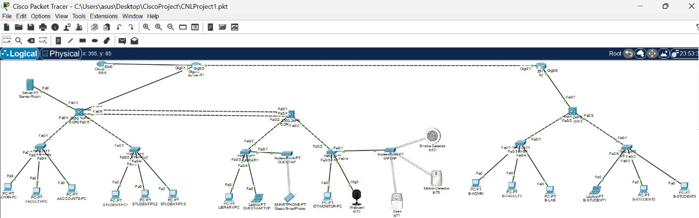
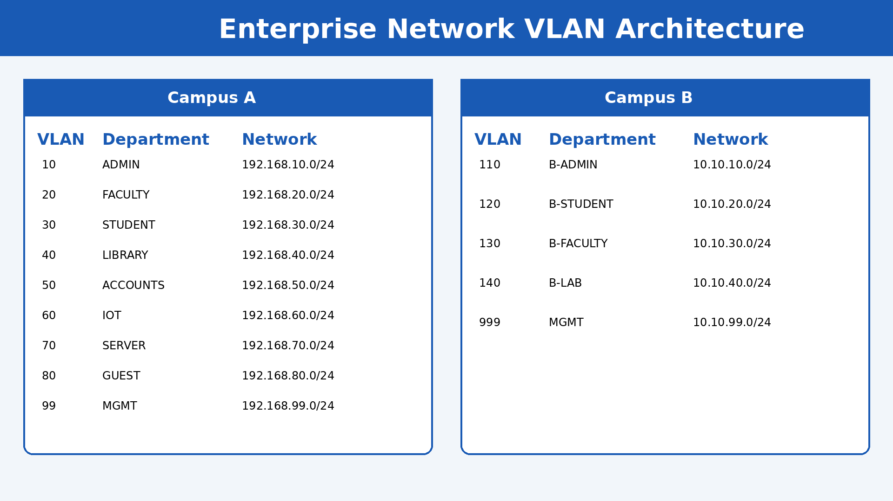
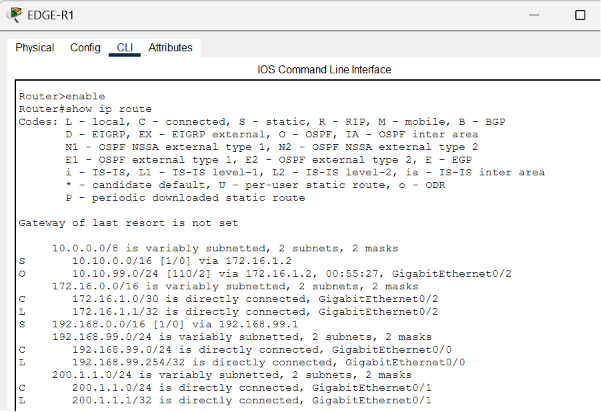
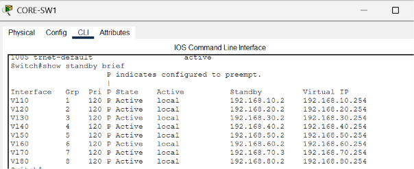
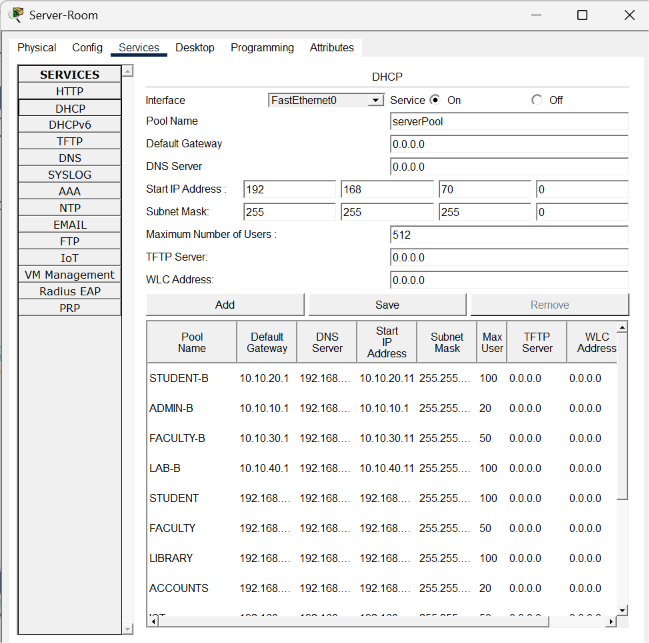
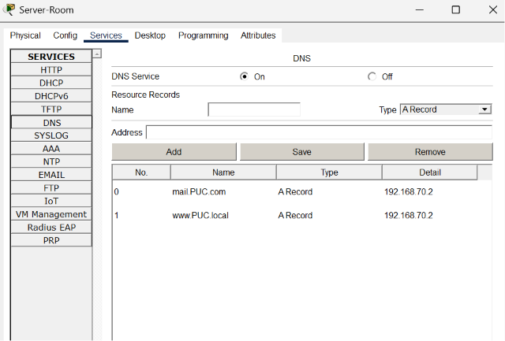
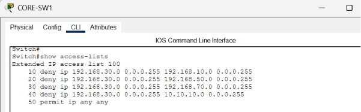
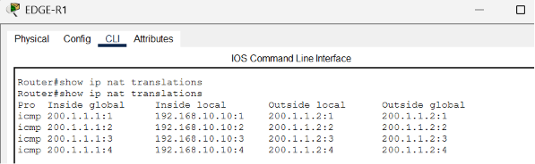
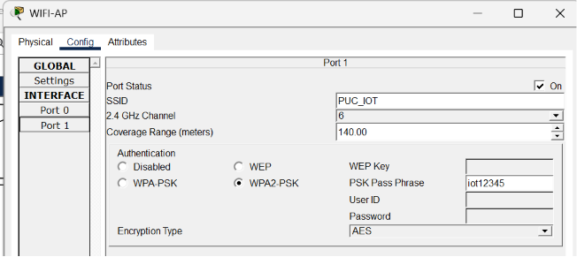

# Enterprise Network Architecture using Cisco Packet Tracer

Project Type: Academic Enterprise Networking Project

Status: Completed

Tools Used: Cisco Packet Tracer

## Project Overview

This project demonstrates a multi-campus enterprise network architecture designed and implemented using Cisco Packet Tracer. The network integrates routing, switching, security, wireless communication, and server services to simulate a real-world enterprise environment.

## Network Features

- VLAN Segmentation
- Inter-VLAN Routing
- OSPF Dynamic Routing
- HSRP Gateway Redundancy
- EtherChannel (LACP)
- DHCP Services
- DNS Services
- HTTP Web Server
- Email Server (SMTP/POP3)
- NAT/PAT
- ACL Security
- Port Security
- Wireless Network
- IoT Integration

## Technologies Used

- Cisco Packet Tracer
- OSPF
- HSRP
- VLAN
- EtherChannel
- DHCP
- DNS
- NAT
- ACL
- Wireless Networking
- IoT Devices

## Network Topology



## Configuration Verification

### VLAN Configuration


### OSPF Dynamic Routing


### HSRP Gateway Redundancy


### DHCP Service


### DNS Service


### ACL Security Policy


### NAT Translation


### Wireless & IoT Integration


## Project Structure

```text
Enterprise-Network-Architecture-Cisco-Packet-Tracer
│
├── README.md
├── Report.pdf
├── Presentation.pptx
├── Network-Topology.png
│
├── PacketTracer
│   └── Enterprise-Network.pkt
│
└── Screenshots
    ├── VLAN.png
    ├── OSPF.png
    ├── HSRP.png
    ├── EtherChannel.png
    ├── NAT.png
    ├── ACL.png
    ├── Wireless.png
    └── IoT.png
```

## Testing Results

✔ VLAN Segmentation Verified

✔ Inter-VLAN Routing Verified

✔ OSPF Dynamic Routing Verified

✔ HSRP Gateway Redundancy Verified

✔ EtherChannel (LACP) Verified

✔ DHCP Automatic IP Assignment Verified

✔ DNS Name Resolution Verified

✔ HTTP Web Service Verified

✔ Email Service (SMTP/POP3) Verified

✔ NAT/PAT Translation Verified

✔ ACL Security Policy Verified

✔ Port Security Verified

✔ Wireless Connectivity Verified

✔ Guest Wireless Access Verified

✔ IoT Device Communication Verified

✔ End-to-End Campus Connectivity Verified

## Author

**Faisal Hamid**

Developed in collaboration with:
- Hasibul Haque Galib
- Emam Hossain Epu

Computer Science and Engineering Student

Research Interests:
- Computer Networks
- Data Science
- Network Security

## Supervisor

Mohammad Hasan

Assistant Professor & Coordinator of M.Sc in CSE

Department of Computer Science and Engineering
